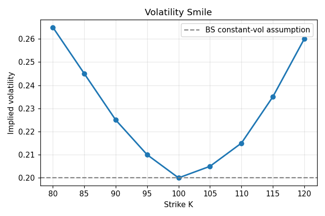
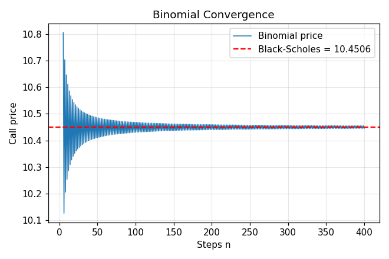
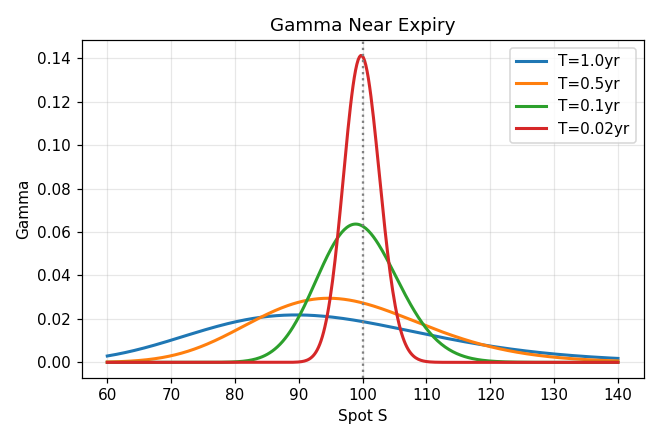

# Options Pricing Engine with Greeks

A Python options-pricing engine built up from the Black-Scholes closed form to numerical methods, with a validation suite and a command-line interface. It prices European and American options, computes the full first-order Greeks, and backs out implied volatility from market prices.

## What it does

An options pricing engine answers one question: *what is a fair price to pay today for the right to buy or sell an asset at a fixed price in the future?* The value comes from the asymmetry of an option — losses are capped at the premium, gains are not — so a more *uncertain* underlying makes an option more valuable regardless of which direction it's expected to move. The engine therefore takes no view on direction; it prices the contract given a model of how much the underlying could move (its volatility).

## Features

- **Black-Scholes pricing** — closed-form European call and put prices.
- **The Greeks** — delta, gamma, vega, theta, and rho, in closed form.
- **Binomial tree (Cox-Ross-Rubinstein)** — handles **American** options via early-exercise checks at each node, which the closed form cannot.
- **Monte Carlo** — simulates price paths under geometric Brownian motion; generalizes to path-dependent and exotic payoffs.
- **Implied volatility** — inverts Black-Scholes for the volatility implied by a market price, using Newton-Raphson with a Brent's-method fallback.
- **Validation suite** — put-call parity, finite-difference checks on every Greek, and cross-method convergence.

## Models and methods

**Black-Scholes** prices a European option in closed form by computing the discounted, risk-neutral expected payoff. The call price `S·N(d1) − K·e^(−rT)·N(d2)` reads as the present value of the stock received minus the present value of the strike paid, each weighted by the probability of exercise. It is exact and instant, but assumes constant volatility and only handles vanilla European exercise.

**The binomial tree** discretizes time into steps where the price moves up or down by fixed factors, then works backward from the expiry payoffs, discounting expected value at each node. Because it knows the price at every intermediate node, it can check for early exercise — so it prices American options, and it converges to Black-Scholes as the number of steps grows.

**Monte Carlo** simulates many terminal prices from the risk-neutral distribution and averages the discounted payoff. Its error shrinks only as `1/√N` (four times the paths to halve the error), so it is slower than the alternatives for vanilla options — but it handles payoffs the closed form cannot touch, which is its reason for existing.

**Implied volatility** runs the model in reverse: markets quote the price, not the volatility, so the engine solves for the volatility that reproduces the observed price. Black-Scholes has no algebraic inverse, but its price is strictly increasing in volatility (a unique root always exists), so root-finding works. Newton-Raphson uses vega as its derivative; Brent's method is the robust fallback when vega is small.

## Validation

Correctness is checked three ways, all passing:

- **Put-call parity:** `Call − Put = S − K·e^(−rT)` holds to machine precision, confirming the call and put formulas are mutually consistent.
- **Greeks by finite difference:** each closed-form Greek is compared against a central-difference approximation (bump an input, re-price, measure the slope). All agree to roughly seven decimal places, validating both the formulas and that each is the derivative of the right quantity.
- **Convergence:** the binomial tree (error ~`1/n`) and Monte Carlo (error ~`1/√N`) both approach the Black-Scholes price as resolution increases, with the tree converging far faster per unit of work.

## Results

Reference case: `S = 100, K = 100, r = 0.05, σ = 0.20, T = 1` — Black-Scholes call ≈ **10.4506**, put ≈ **5.5735**.



Implied volatility plotted across strikes is not flat, contradicting the constant-volatility assumption Black-Scholes is built on. The market prices in fatter tails than the lognormal model allows, so out-of-the-money options carry higher implied vol. *(Note: generated from illustrative quotes; swap in a real option chain for an authentic surface.)*



The binomial price oscillates in and settles onto the Black-Scholes value as the step count grows — an independent confirmation that the two methods agree.



Gamma concentrates into a sharp spike at the strike as expiry approaches: a near-expiry at-the-money option's delta swings between 0 and 1 over a tiny price range, which is the source of "pin risk" in hedging.

## Usage

```bash
git clone https://github.com/rkdhruv/options-pricing-engine
cd options-pricing-engine
python -m venv venv && source venv/bin/activate
pip install -r requirements.txt

# Price an option from the command line
cd src
python cli.py --S 100 --K 100 --sigma 0.2 --T 1
python cli.py --S 100 --K 110 --sigma 0.25 --T 0.5 --option put --method tree

# Run the validation suite and regenerate the figures
python validate.py
python plots.py
```

## Project structure

```
src/
  black_scholes.py   # closed-form call/put pricing
  greeks.py          # delta, gamma, vega, theta, rho
  binomial.py        # CRR tree (European + American)
  monte_carlo.py     # Monte Carlo pricer
  implied_vol.py     # implied vol via Newton-Raphson + Brent
  validate.py        # parity, finite-difference, convergence checks
  cli.py             # command-line interface
  plots.py           # generates the figures above
figures/             # output plots
NOTES.md             # derivations and concept notes
```

## References

- Hull, *Options, Futures, and Other Derivatives* — standard reference for all models here.
- Joshi, *The Concepts and Practice of Mathematical Finance* — the reasoning behind the formulas.
- `scipy.stats.norm` (normal CDF/PDF) and `scipy.optimize` (root-finding for implied vol).